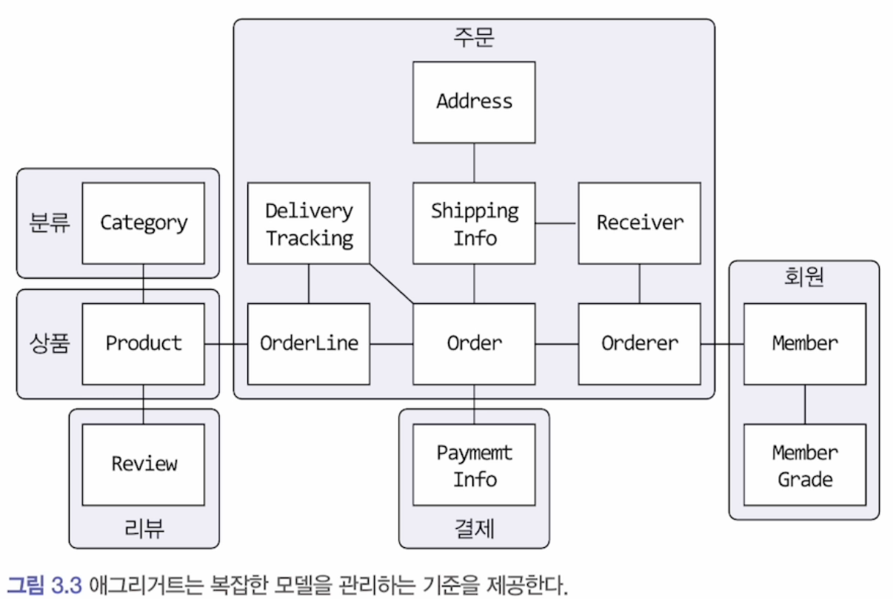
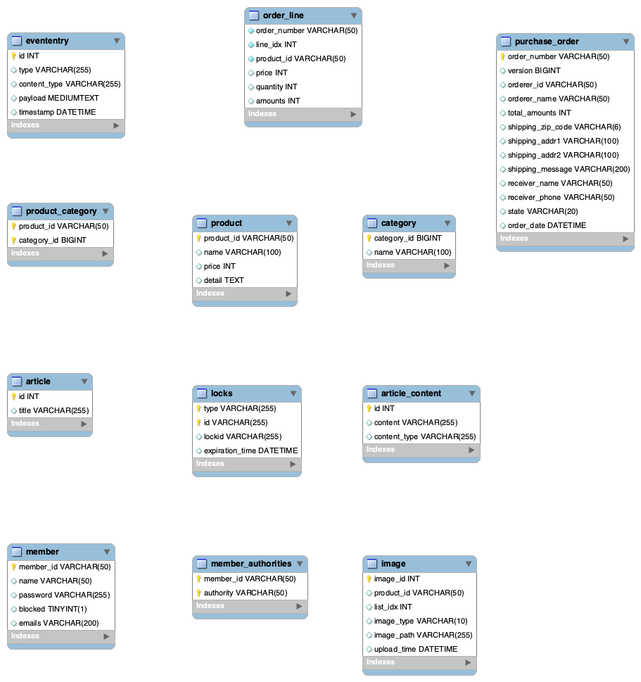

# hello-kopring-with-ddd
kotlin 기반 스프링 부트로 ddd 시작해보기

## 개요

* [도메인 주도 개발 시작하기](https://www.hanbit.co.kr/store/books/look.php?p_code=B4309942517) 책의 [예제](https://github.com/madvirus/ddd-start2) 를 kotlin 으로 구현한 프로젝트

## 도메인 모델
* 애그리거트 관점으로 묶은 도메인 모델

## DB ERD

